# 🤖 Ultra Low Latency Voice AI Agent with Multi-Tool Support: Samantha

An intelligent AI assistant built with **FastRTC**, **Streamlit**, **Anam AI**, **LangGraph**, **Cerebras**, and **Mem0**. Samantha provides **three powerful interfaces**: an **ultra-low latency voice agent**, a **clean text-based chat interface**, and a **live video agent with AI avatar** — all with advanced capabilities including persistent memory, web search, RAG-based document queries, flight & hotel booking, job search, recipe discovery, shopping, stock market analysis, and weather updates.

## 🆕 What's New

### Latest Updates
- **🎥 Anam Video AI Agent**: Integrated realistic AI avatar with speech-to-speech capabilities
- **💾 Mem0 Memory System**: Persistent memory across conversations for personalized interactions
- **🔄 SerpApi Migration**: Upgraded from Firecrawl to SerpApi for faster, more reliable flight, hotel, recipe, and job searches
- **🛍️ Shopping Agent**: New Google Shopping integration via Serper API
- **💼 Job Search Agent**: Find career opportunities using Google Jobs
- **👨‍🍳 Recipe Agent**: Discover recipes with ingredients, ratings, and cooking times
- **🧠 Multi-Agent Architecture**: Supervisor-based system with 10 specialized agents

## ✨ Key Features

- **💬 Clean Chat Interface**: Streamlit-based UI for seamless text conversations
- **🎥 Anam Video AI Agent**: Live speech-to-speech interaction with realistic AI avatar powered by Anam AI
- **🎙️ Voice Agent**: Ultra-low latency voice interface using FastRTC and Cartesia TTS
- **🧠 Intelligent Multi-Agent System**: Built with LangGraph and Cerebras (GPT-OSS-120B) with 10 specialized agents
- **💾 Persistent Memory**: Mem0 integration for remembering user preferences and past conversations
- **📚 RAG System**: ChromaDB-powered document knowledge base with PDF ingestion
- **🛠️ Rich Toolset**: 10+ specialized tools powered by SerpApi, Mem0, and other modern APIs
- **📄 Document Upload**: Easy PDF ingestion through web interface
- **🎨 Modern UI**: Beautiful, responsive design with emoji-enhanced interactions

## 🏗️ Architecture

```mermaid
graph TB
    subgraph "User Interfaces"
        A["🌐 Streamlit UI"]
        A --> B["💬 Chat Interface"]
        A --> C["📚 Document Upload"]
        A --> D["🎥 Anam Video Agent"]
        E["🎙️ Gradio UI"] --> F["⚡ FastRTC Engine"]
    end

    subgraph "Backend Services"
        G["⚙️ FastAPI Backend"]
        D --> G
        G --> H["🎭 Anam AI Service"]
        H --> I["👤 AI Avatar"]
    end

    subgraph "Core Agent Logic"
        B --> J["🧠 LangGraph Supervisor"]
        G --> J
        F --> K["🎤 SpeechRecognition STT"]
        K --> J
        J --> L["🤖 Cerebras LLM"]
        J --> M["🔊 Cartesia TTS"]
        M --> F
        J <--> MEM["💾 Mem0 Memory"]
    end

    subgraph "Multi-Agent System"
        J --> AG1["🔍 Research Agent"]
        J --> AG2["💰 Finance Agent"]
        J --> AG3["✈️ Travel Agent"]
        J --> AG4["📚 Database Agent"]
        J --> AG5["🛍️ Shopping Agent"]
        J --> AG6["💼 Job Agent"]
        J --> AG7["🧠 Memory Agent"]
        J --> AG8["👨‍🍳 Recipe Agent"]
    end

    subgraph "Data & Tools"
        C --> N["📄 PDF Processing"]
        N --> O["📊 ChromaDB"]
        
        AG1 --> Q["� Tavily API"]
        AG2 --> S["📈 YFinance"]
        AG3 --> T1["🌦️ OpenWeatherMap"]
        AG3 --> T2["✈️ SerpApi Flights"]
        AG3 --> T3["🏨 SerpApi Hotels"]
        AG4 --> O
        AG5 --> SH["🛒 Serper Shopping"]
        AG6 --> JB["� SerpApi Jobs"]
        AG7 --> MEM
        AG8 --> RC["👨‍� SerpApi Recipes"]
    end
```



### 🔄 Data Flow

```
Text Flow:   Streamlit Chat → Supervisor → Specialized Agent → Tool → Mem0 → Response
Video Flow:  Streamlit Video → FastAPI → Supervisor → Agent → Tool → Anam AI Avatar
Voice Flow:  Gradio Audio → STT → Supervisor → Agent → Tool → TTS → Audio Output
Memory Flow: User Input → Mem0 Context Retrieval → Agent Processing → Mem0 Storage
```

## 🛠️ Multi-Agent System & Capabilities

Samantha uses a **supervisor-based multi-agent architecture** with 10 specialized agents:

| Agent | Capabilities | Tools & Providers |
|-------|--------------|-------------------|
| 🔍 **Research Agent** | Web search, current events, news | Tavily API |
| 💰 **Finance Agent** | Stock prices, company info, market data | YFinance |
| ✈️ **Travel Agent** | Weather, flights, hotels | OpenWeatherMap, SerpApi (Google Flights & Hotels) |
| 📚 **Database Agent** | RAG document search, knowledge base | ChromaDB + HuggingFace Embeddings |
| 🛍️ **Shopping Agent** | Product search, price comparison | Serper (Google Shopping) |
| 💼 **Job Agent** | Job postings, career opportunities | SerpApi (Google Jobs) |
| 🧠 **Memory Agent** | Past conversations, user preferences | Mem0 Memory Platform |
| �‍🍳 **Recipe Agent** | Recipe search, cooking instructions | SerpApi (Google Recipes) |
| 💬 **Respond Agent** | Greetings, casual conversation | Cerebras LLM + Mem0 |
| � **Supervisor** | Routes queries to appropriate agents | Cerebras LLM + Mem0 Context |

## 🚀 Tech Stack

| Component | Technology |
|-----------|-----------|
| **UI Frameworks** | [Streamlit](https://streamlit.io/) (Chat + Video Agent) & [Gradio](https://gradio.app/) (Voice) |
| **Video Avatar** | [Anam AI](https://anam.ai/) SDK with Custom LLM Integration |
| **Backend API** | [FastAPI](https://fastapi.tiangolo.com/) (for Video Agent) |
| **Voice Streaming** | [FastRTC](https://github.com/fastrtc/fastrtc) |
| **LLM** | [Cerebras](https://cerebras.net/) (gpt-oss-120b) |
| **Agent Framework** | [LangGraph](https://langchain-ai.github.io/langgraph/) Multi-Agent with Supervisor |
| **Memory System** | [Mem0](https://mem0.ai/) for persistent user memory |
| **STT** | SpeechRecognition (Google) |
| **TTS** | [Cartesia](https://cartesia.ai/) Sonic 3 |
| **Vector DB** | ChromaDB with persistent storage |
| **Embeddings** | HuggingFace (sentence-transformers/all-MiniLM-L6-v2) |
| **RAG LLM** | Groq (llama-3.3-70b-versatile) |
| **Search APIs** | SerpApi (Flights, Hotels, Jobs, Recipes), Serper (Shopping), Tavily (Web) |
| **PDF Processing** | PyPDF, RecursiveCharacterTextSplitter |

## 📋 Prerequisites

- **Python**: 3.10 or higher
- **API Keys** (required):
  - [Cerebras](https://cerebras.net/) - Main LLM for all agents
  - [Mem0](https://mem0.ai/) - Persistent memory system
  - [Cartesia](https://cartesia.ai/) - Ultra-fast TTS for voice agent
  - [Groq](https://groq.com/) - RAG LLM for document queries
  - [Tavily](https://tavily.com/) - Web search
  - [SerpApi](https://serpapi.com/) - Google Flights, Hotels, Jobs, Recipes
  - [Serper](https://serper.dev/) - Google Shopping search
  - [OpenWeatherMap](https://openweathermap.org/) - Weather data
  - [Anam AI](https://anam.ai/) - Video avatar with AI persona
  - [HuggingFace](https://huggingface.co/) - Embeddings (optional token)
- **Optional**:
  - [LangSmith](https://smith.langchain.com/) - Agent tracing and monitoring

## 📦 Installation

### 1. Clone the Repository
```bash
git clone https://github.com/Bharath8080/FastRTC_ReAct_Agent.git
cd FastRTC_ReAct_Agent
```

### 2. Create Virtual Environment
```bash
python -m venv .venv

# Windows
.venv\Scripts\activate

# macOS/Linux
source .venv/bin/activate
```

### 3. Install Dependencies
```bash
pip install -r requirements.txt
```

## ⚙️ Configuration

Create a `.env` file in the root directory:

```ini
# Core LLM
CEREBRAS_API_KEY=your_cerebras_key
GROQ_API_KEY=your_groq_key

# Memory System
MEM0_API_KEY=your_mem0_key

# Voice Services
CARTESIA_API_KEY=your_cartesia_key

# Video Agent
ANAM_API_KEY=your_anam_key

# Search & Tools
TAVILY_API_KEY=your_tavily_key
SERPAPI_API_KEY=your_serpapi_key
SERPER_API_KEY=your_serper_key
OPENWEATHERMAP_API_KEY=your_openweathermap_key

# Optional - Embeddings
HF_TOKEN=your_huggingface_token

# Optional - LangSmith Tracing
LANGSMITH_TRACING=true
LANGSMITH_ENDPOINT=https://api.smith.langchain.com
LANGSMITH_API_KEY=your_langsmith_key
LANGSMITH_PROJECT=FastRTC_Agent
```

## 🚀 Usage

Samantha offers **three ways to interact** with the AI assistant:

### 1️⃣ 💬 Text Chat Interface (Streamlit)

For text-based interaction and document management:

```bash
streamlit run main.py
```

The app will launch at `http://localhost:8501`

**How to use:**
1. **Open the Chat tab** (default)
2. **Type your question** in the input field
3. **Click Send** or press Enter
4. **View responses** in the chat history

### 2️⃣ 🎥 Video Agent (Streamlit + AI Avatar)

For live speech-to-speech interaction with an AI avatar:

**Step 1: Start the Backend Server**
```bash
uvicorn backend:app --port 8000 --reload
```

**Step 2: Start Streamlit**
```bash
streamlit run main.py
```

**Step 3: Use the Video Agent**
1. Navigate to the **🎥 Video Agent** tab
2. Wait for the avatar to connect
3. Click **"Start Conversation"** to begin
4. Speak naturally - the avatar will respond with voice and animation
5. Click **"Stop Conversation"** to pause
6. Click **"End Session"** to terminate

> **Note**: The Video Agent requires both the FastAPI backend (port 8000) and Streamlit (port 8501) to be running simultaneously.

### 3️⃣ 🎙️ Voice Agent (Gradio - Ultra-Low Latency)

For real-time Speech-to-Speech (STS) interaction with ultra-low latency:

```bash
python app.py
```

The Gradio UI will launch at `http://localhost:7860`. This interface uses **FastRTC** for streaming audio and **Cartesia Sonic 3** for high-quality, low-latency speech generation.

### 📚 Adding Documents to RAG System

To enable Samantha to answer questions about your documents:

1. **Switch to the "Upload Documents" tab** in Streamlit
2. **Upload PDFs** using the file uploader
3. **Click "🚀 Ingest Documents"** to process and store in ChromaDB
4. **Return to Chat tab** and ask questions about your documents

**Example queries**:
- "What does the manual say about installation?"
- "Search the database for pricing information"
- "What's in the uploaded document about security?"

### 🧠 Memory System

Samantha uses **Mem0** to remember information about you across conversations:

**Initial Setup** (Optional):
```bash
python scripts/add_initial_memory.py
```

This script adds initial memories about the user. You can customize it to add your own information.

**Memory Features**:
- Automatically remembers user preferences and past conversations
- Ask "What do you remember about me?" to see stored memories
- Search specific memories: "Do you remember my favorite food?"
- Context-aware responses based on past interactions

**Example queries**:
- "What do you know about me?"
- "Do you remember what I studied?"
- "What are my interests?"

## 📂 Project Structure

```
FastRTC_ReAct_Agent/
├── main.py                     # Streamlit main app with navigation
├── backend.py                   # FastAPI backend for Video Agent
├── app.py                      # Gradio voice interface
├── ingest.py                   # Standalone PDF ingestion tool
├── requirements.txt            # Python dependencies
├── .env                        # Environment variables (create this)
│
├── config/                     # Configuration settings
│   └── settings.py            # Pydantic settings for Anam AI
│
├── services/                   # External service integrations
│   └── anam_service.py        # Anam AI API client
│
├── pages/                      # Streamlit page components
│   ├── chat.py                # Chat interface page
│   ├── upload_documents.py    # Document upload page
│   └── video_agent.py         # Anam Video agent with AI avatar
│
├── scripts/
│   ├── agent.py                # LangGraph multi-agent system
│   └── add_initial_memory.py   # Script to initialize Mem0 memories
│
├── tools/                      # Tool implementations
│   ├── __init__.py
│   ├── tavily_tool.py          # Web search (Tavily)
│   ├── database_tool.py        # RAG document search (ChromaDB)
│   ├── flight_tool.py          # Flight search (SerpApi)
│   ├── hotel_tool.py           # Hotel search (SerpApi)
│   ├── recipe_tool.py          # Recipe search (SerpApi)
│   ├── job_search_tool.py      # Job search (SerpApi)
│   ├── shop_tool.py            # Shopping search (Serper)
│   ├── memory_tool.py          # Memory retrieval (Mem0)
│   ├── stock_tools.py          # Stock price & company info (YFinance)
│   └── weather_tool.py         # Weather data (OpenWeatherMap)
│
├── assets/
│   └── anam.png                # Application logo
│
└── chroma_db/                  # ChromaDB vector store (auto-created)
```

## 🎯 How It Works

### 1. User Input
```python
# User types message in Streamlit chat interface
user_input = st.text_input("Ask me anything...")
```

### 2. Agent Decision Making
```python
# LangGraph agent with Cerebras LLM
agent_reply = agent.invoke(
    {"messages": [{"role": "user", "content": user_input}]},
    config=agent_config
)
```

### 3. Tool Execution
The supervisor intelligently routes queries to specialized agents based on the query:
- **General questions** → Research Agent (Tavily)
- **Document questions** → Database Agent (ChromaDB)
- **Travel queries** → Travel Agent (Flights, Hotels, Weather)
- **Stocks** → Finance Agent (YFinance)
- **Shopping** → Shopping Agent (Serper)
- **Jobs** → Job Agent (SerpApi)
- **Recipes** → Recipe Agent (SerpApi)
- **Memory queries** → Memory Agent (Mem0)
- **Greetings/Chat** → Respond Agent (Direct LLM)

### 4. Response Display
```python
# Display response in chat interface
st.session_state.messages.append({
    "role": "assistant", 
    "content": response
})
```

## 🎨 Features in Detail

### 💬 Chat Interface
- **Real-time messaging**: Instant responses with conversation history
- **Session persistence**: Chat history maintained during session
- **Memory-enhanced**: Personalized responses based on past conversations
- **Clean UI**: Emoji-enhanced, user-friendly design
- **Error handling**: Graceful error messages for failed requests
- **Suggestion questions**: Quick-start prompts for common queries

### 🎥 Anam Video AI Agent
- **Realistic AI Avatar**: Live video with lip-sync and natural expressions
- **Speech-to-Speech**: Real-time voice interaction with avatar
- **Custom LLM Integration**: Uses Cerebras + LangGraph for intelligent responses
- **Session Management**: Persistent sessions with conversation context
- **Multi-tool Access**: Avatar can use all 10 specialized agents
- **FastAPI Backend**: Robust backend for handling video agent requests

### 🧠 Multi-Agent System
- **Supervisor Architecture**: Intelligent routing to specialized agents
- **10 Specialized Agents**: Each expert in their domain
- **Context Sharing**: Agents share context via Mem0 memory
- **Parallel Processing**: Efficient task distribution
- **Fallback Handling**: Graceful degradation if tools fail

### 💾 Memory System (Mem0)
- **Persistent Memory**: Remembers user preferences across sessions
- **Contextual Retrieval**: Automatically fetches relevant memories
- **Automatic Storage**: Saves important information from conversations
- **Search Capabilities**: Query specific memories or get all stored info
- **Privacy-Focused**: User-specific memory isolation

### 📚 Document Management
- **Multi-file upload**: Upload multiple PDFs simultaneously
- **Progress tracking**: Visual feedback during ingestion
- **Automatic chunking**: Smart text splitting for optimal retrieval
- **Persistent storage**: Documents stored in ChromaDB for future queries
- **Source attribution**: Responses include source document references

### 🔍 Advanced Search Tools
- **Web Search**: Real-time information via Tavily API
- **Flight Search**: Google Flights via SerpApi with pricing and schedules
- **Hotel Search**: Google Hotels via SerpApi with ratings and amenities
- **Recipe Search**: Google Recipes via SerpApi with ingredients and ratings
- **Job Search**: Google Jobs via SerpApi with company and role details
- **Shopping Search**: Google Shopping via Serper with prices and reviews

### RAG System
- **Embeddings**: sentence-transformers/all-MiniLM-L6-v2 (384 dimensions)
- **Vector DB**: ChromaDB with persistent storage
- **Chunking**: 1000 chars with 200 overlap
- **Retrieval**: Top 3 relevant chunks with source metadata

## 🔧 Advanced Configuration

### Customize Agent Behavior
```python
# In scripts/agent.py
system_prompt = """
You are Samantha, a helpful AI agent.
[Customize personality and instructions here]
"""
```

### Adjust LLM Parameters
```python
# In scripts/agent.py
model = ChatCerebras(
    model="gpt-oss-120b",
    max_tokens=512,  # Adjust response length
    temperature=0.7,  # Control randomness (0.0-1.0)
)
```

### Modify RAG Settings
```python
# In main.py
text_splitter = RecursiveCharacterTextSplitter(
    chunk_size=1000,      # Adjust chunk size
    chunk_overlap=200,    # Adjust overlap
)
```

## 📊 Performance Metrics

- **LLM Latency**: ~0.5-1.5s (Cerebras gpt-oss-120b)
- **Tool Execution**: Varies by tool (0.5-3s)
- **RAG Query**: ~0.5-1s (ChromaDB retrieval)
- **Total Response Time**: ~1-4s average

## 🐛 Troubleshooting

### Database Tool Not Working
- Upload at least one PDF via the "Upload Documents" tab
- Ensure ChromaDB directory has write permissions
- Check that `GROQ_API_KEY` is set for RAG queries

### API Key Errors
- Verify all keys in `.env` file
- Check API quotas and billing
- Ensure no extra spaces in `.env`
- Restart the application after updating `.env`

### Import Errors
```bash
# Reinstall dependencies
pip install -r requirements.txt --force-reinstall
```

### Streamlit Issues
```bash
# Clear Streamlit cache
streamlit cache clear
# Restart the application
streamlit run main.py
```

## 🤝 Contributing

Contributions are welcome! Please:

1. Fork the repository
2. Create a feature branch (`git checkout -b feature/amazing-feature`)
3. Commit changes (`git commit -m 'Add amazing feature'`)
4. Push to branch (`git push origin feature/amazing-feature`)
5. Open a Pull Request

## 📄 License

This project is licensed under the MIT License - see the LICENSE file for details.

## 🙏 Acknowledgments

- **Streamlit** - Beautiful web UI framework
- **Anam AI** - Realistic AI avatar with speech-to-speech capabilities
- **Cerebras** - Ultra-fast LLM inference
- **Mem0** - Persistent memory platform for AI agents
- **LangChain/LangGraph** - Multi-agent orchestration framework
- **SerpApi** - Comprehensive Google search API (Flights, Hotels, Jobs, Recipes)
- **Serper** - Google Shopping API
- **ChromaDB** - Vector database for RAG
- **HuggingFace** - Embeddings and models
- **FastRTC** - Ultra-low latency voice streaming

## 📞 Support

For issues and questions:
- Open an issue on GitHub
- Check existing documentation
- Review conversation history for similar problems

---

**Built with ❤️ using Streamlit, LangGraph, and Cerebras**
